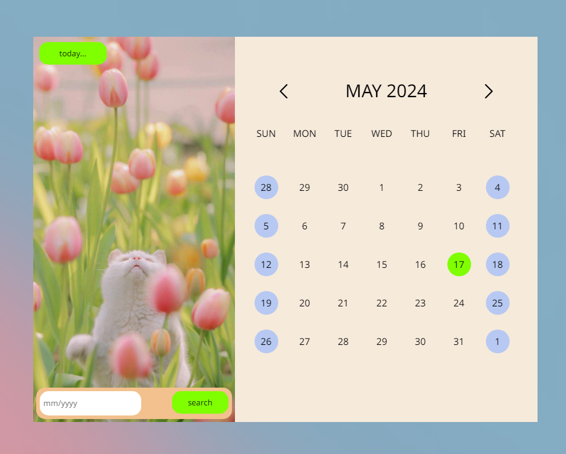
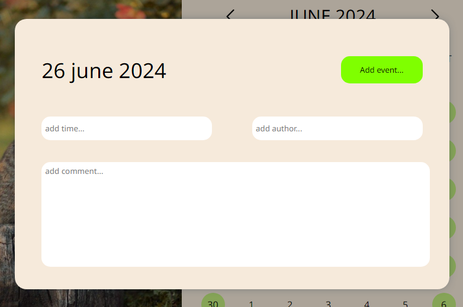

# Cat-calendar planning page

Our calendar was made in order for planning your events or using it as a diary. These little cuties on the left are going to make your day even brighter - choose your favourite by pushing the arrows!


===

By clicking on the day you can put the exact time of your event (all you need is to type the numbers - don`t care about other symbols), mention yourself or anybody else as author and of course write down the event or what is going to be on your mind then.


===

Try to find the day of your birth using the search-area (all you need is to type the numbers - don`t care about other symbols). Put the month and year numbers, click on the search button or hit enter.

Don`t be scared to get lost in the year diapason - just click on the today button and come back to nowaday.

Our project does not include any frameworks or libraries - except built-in Node.js ones and installed additional packages for making our development process more comfortable (eg eslint, chalk, nodemon).

# How to run

1. Clone this repository
```
git clone https://github.com/namanica/calendar
```
2. Run the local server
```
npm run dev
```
3. Open http://localhost:3000 with your browser to see the result